# Лабораторно-практична робота №1
## Тема: Проходження інтерактивного курсу «Git How To»

**Мета:** Ознайомитися з базовими командами та принципами роботи з системою контролю версій Git шляхом проходження інтерактивного навчального курсу. Сформувати практичні навички використання Git у консольному середовищі для виконання основних операцій.

### Хід виконання роботи

Було виконано обов'язкову частину завдання — пройдено **Частину 1** інтерактивного курсу [Git How To](https://githowto.com/uk).

Нижче наведено підтвердження успішного проходження кроків курсу:

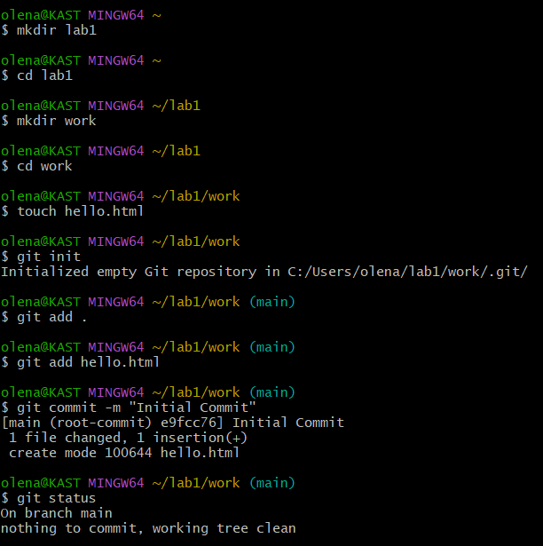
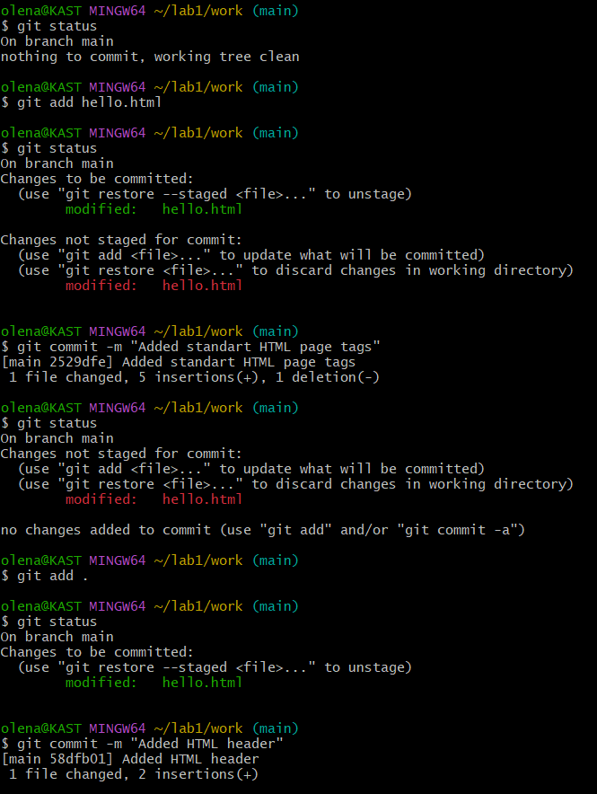
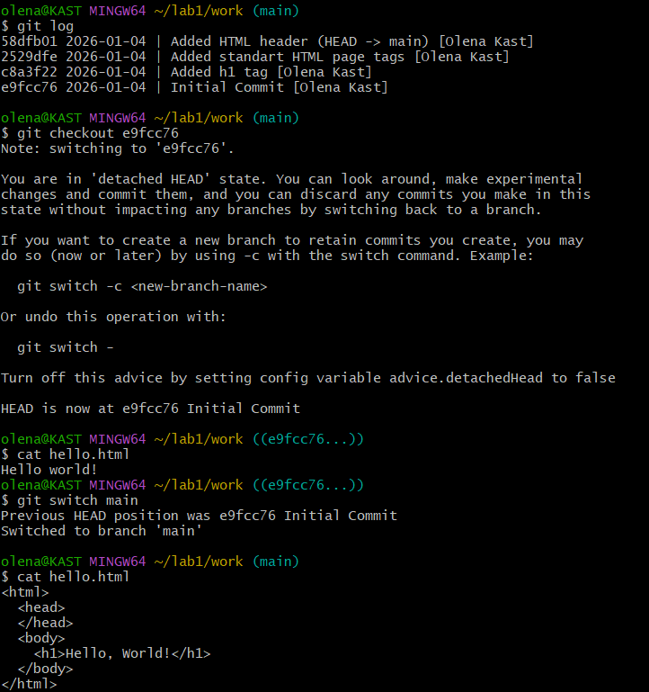
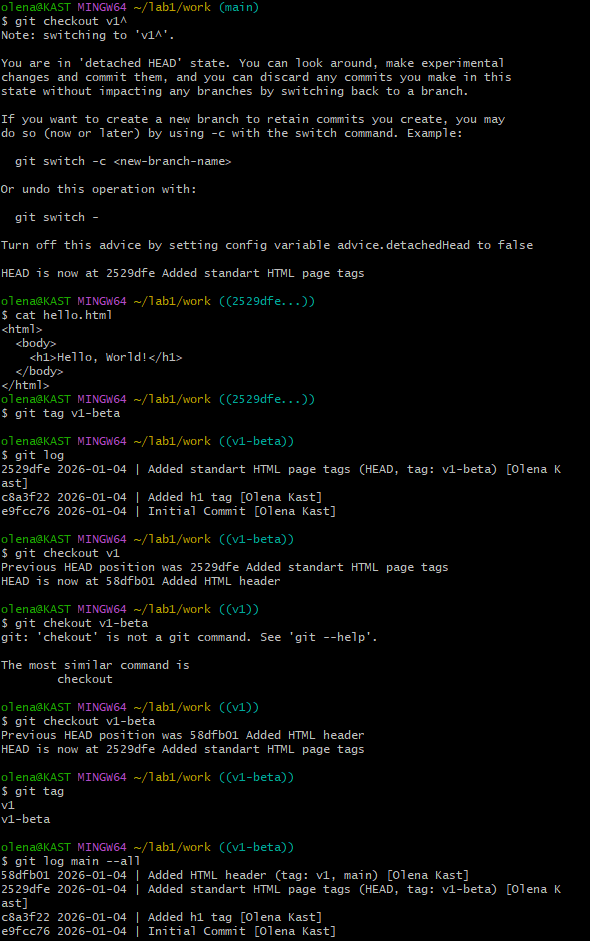
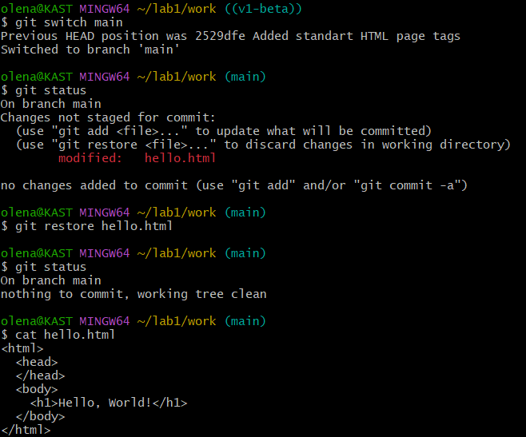
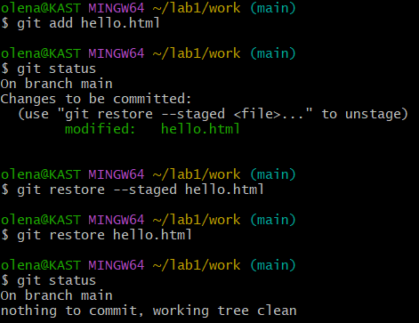
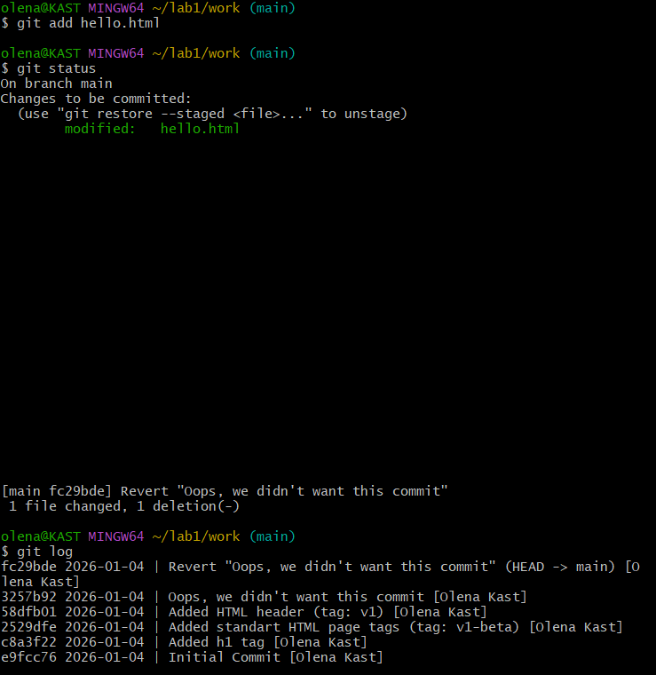
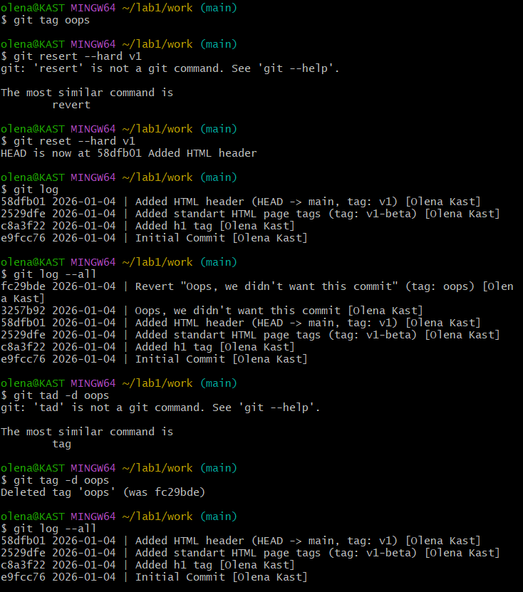
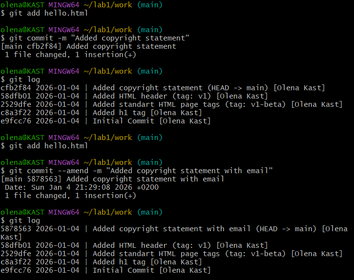
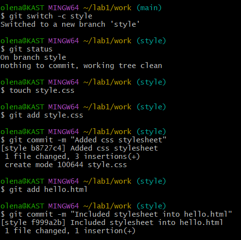

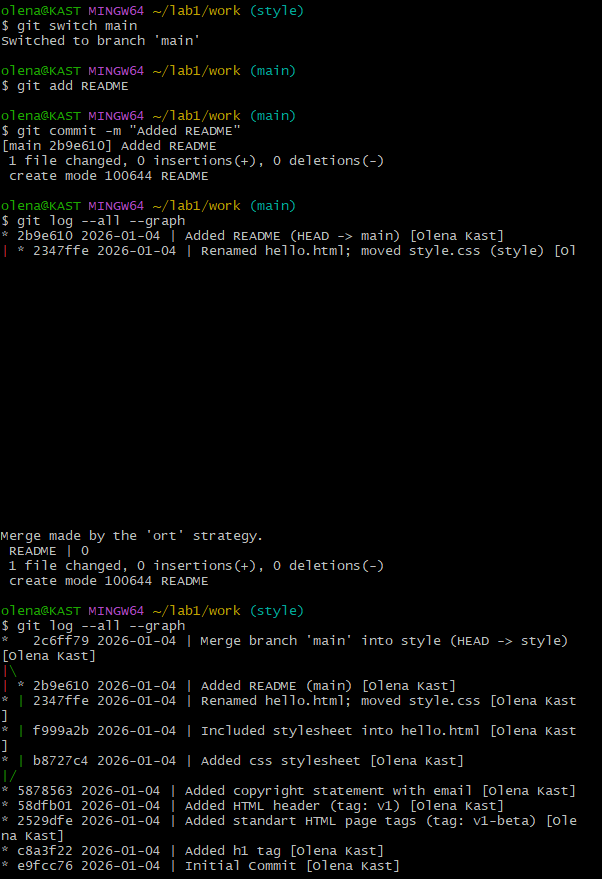
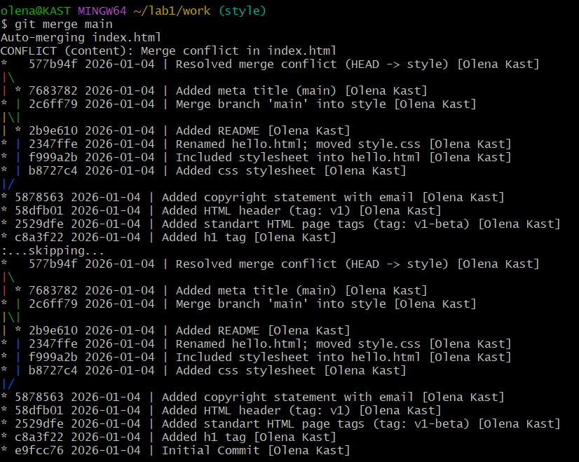
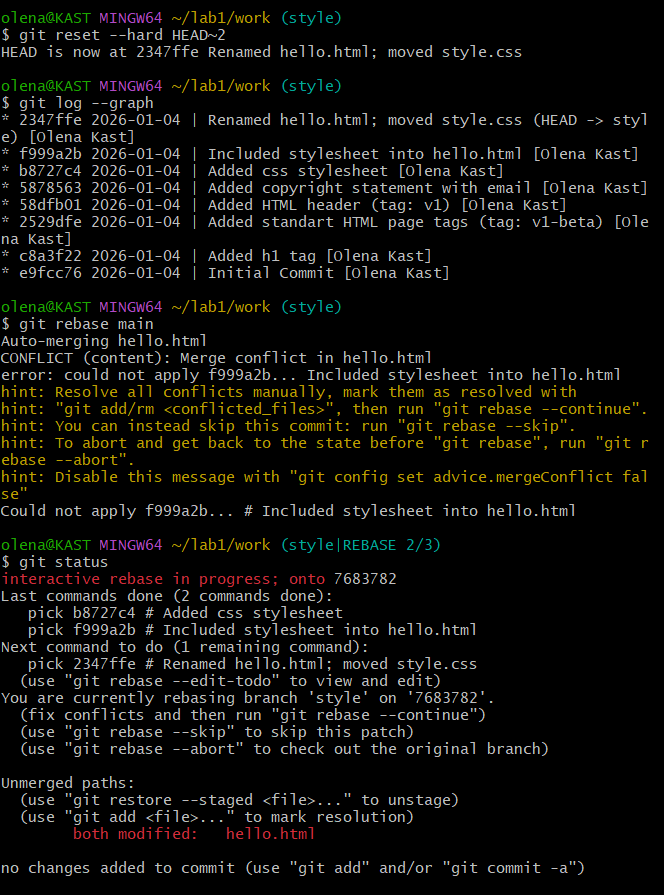
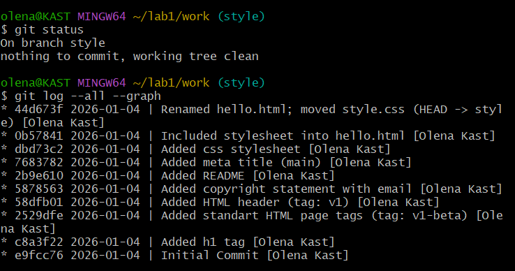
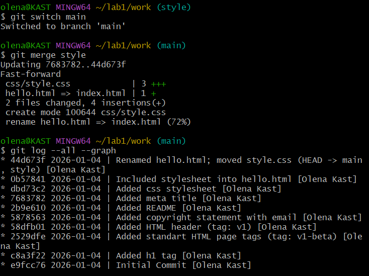

### Висновки
Під час виконання лабораторної роботи я ознайомилася з основами роботи в системі контролю версій Git. Я навчилася створювати локальний репозиторій, фіксувати зміни у файлах, переглядати історію проєкту, повертатися до попередніх версій коду, вирішувати конфлікти з різними гілками і інше.
